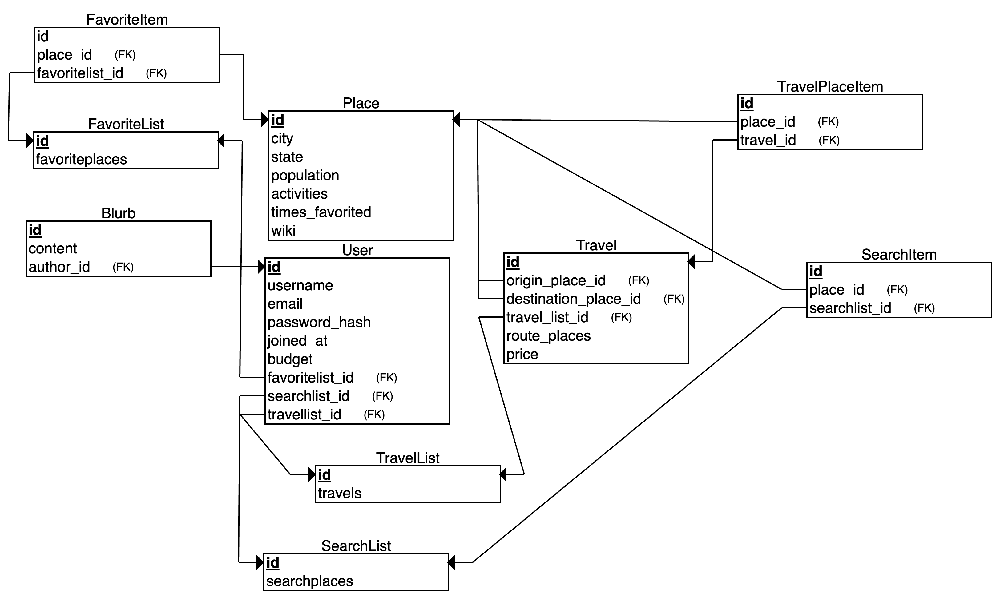

# Travel App

## Introduction
Interactive web application for planning road trips, offering information on destinations, activities, cost estimates, and user-specific journey insights. Features secure user profiles for personalized trip planning.

## Getting Started

### Prerequisites & Installation
- Python >= 3.10
- [Poetry](https://python-poetry.org/docs/#installation) for dependency management

1. Clone the repository or download the ZIP file and extract it.
2. Navigate to the project's root directory.
3. Install dependencies using Poetry: 
```bash
poetry install
```


## Setting Up the Database and Running the Application
To completely reset the database, use the provided script:
```bash
poetry run python scripts/add_db_data.py
```

Start the application with the following command:
```bash
poetry run python run.py
```

Access the app by navigating to `http://127.0.0.1:5000/` in your web browser.

## Demo
An example run of the app, showing most features and functionality (**Click image to view video**).
[](https://drive.google.com/file/d/1ajuBFztCUSt-SwGG6n6ECF2s3jMsB2FV/view?usp=sharing)

## Database Schema



## Project Structure
A brief overview of the project structure is as follows:

- `app/`: The Flask application and its modules.
- `scripts/`: Utility scripts for database and other tasks.
- `tests/`: Test cases for the application.

For a detailed explanation of the project structure, please refer to the [App Project Structure Wiki](https://github.com/DeepBlockDeepak/RoadTripPlanner/wiki/App-Project-Structure-Documentation).


## Testing
Run the tests using the following command:
```bash
poetry run pytest
```


## Contributing
Please read [CONTRIBUTING.md](CONTRIBUTING.md) for details on our code of conduct, and the process for submitting pull requests to us.


